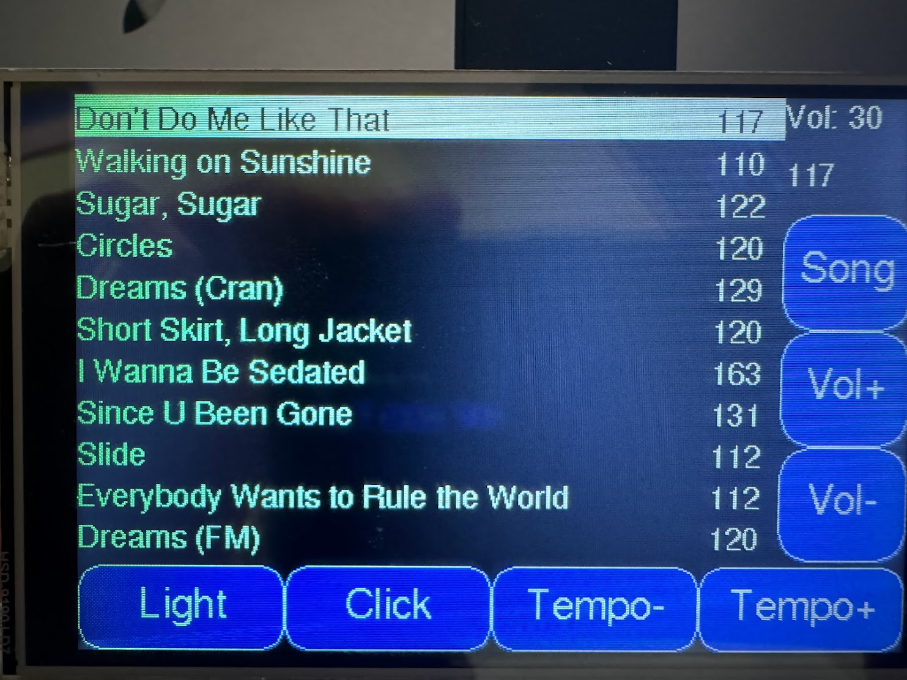
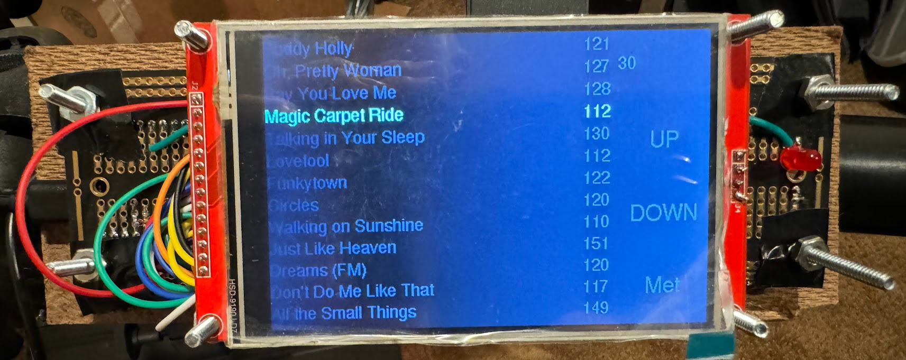
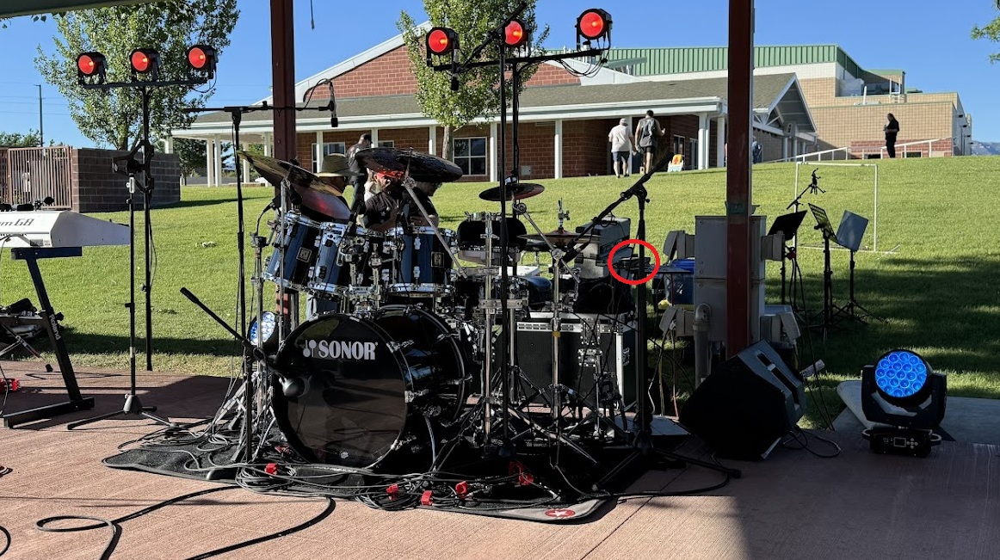

# Description
This project is a setlist and metronome designed to be used by band performers while on-stage. It uses an ESP32-S3 wired up to a 4" touchscreen that will 
display the song list for a performance, as well as the tempo in BPM (beats-per-minute). Notes for each song can be stored and viewed by touching a button
on the display, and the song list can be navigated by touching the display. It can also keep track of different bands and different song lists for each band.

Optionally, a 3.5" headphone jack may be wired up, along with
a pair of amplifier boards (similar to [these](https://www.amazon.com/HiLetgo-TDA1308-Headphone-Amplifier-Preamplifier/dp/B09KGZ2F6D)
to provide a "click" while playing. Also, an LED may be wired up to flash with the tempo.

Finally, a 1/4" jack may be used to accept input from a piezo trigger, as is typically used by electronic drum pads like [these](https://www.amazon.com/Roland-Electronic-Drum-8-inch-PDX-8/dp/B000JBY182).
Tapping the drum pad will reset the tempo, and is useful for songs that have tempo changes, or when the band simply gets off tempo.

As a drummer in two working bands, this device has become an integral part of my on-stage setup over the past year. Having the tempo, song notes, and song 
list at my fingertips has been extrememly helpful. It's hard for me to imagine doing a show without it.

# Building
This project builds with Platform IO and the ESP-IDF SDK, verison 5.3 or later. Outside of the two Arduino dependencies (TFT_eSPI_ES32Lab and ArduinoJson), this 
project does not rely on the Arduino libraries, and uses ESP-IDF/FreeRTOS instead.

# Note
Please be aware that this is a hobby project. It's not complete, and there are a handful of minor, annoying bugs. It is, however, functional enough and reliable enough
that I've relied on it for every gig I've played for the past year. Most of my efforts now are going into a new version that supports a larger touch screen and uses
[LVGL](https://github.com/lvgl/lvgl) for the UI.

# Usage
Below are a few pictures of the (mostly) finished product in action. Since it's unfinished, I haven't 3D printed a case for it. I'm currently using it as
seen in the pictures. It's so small that it's practically unnoticable to the audience.

# Pictures
Below are a few photos of the device in action.
 

### Close up

  

### Attached to a drum rack

  

### On stage, with a full drum kit

